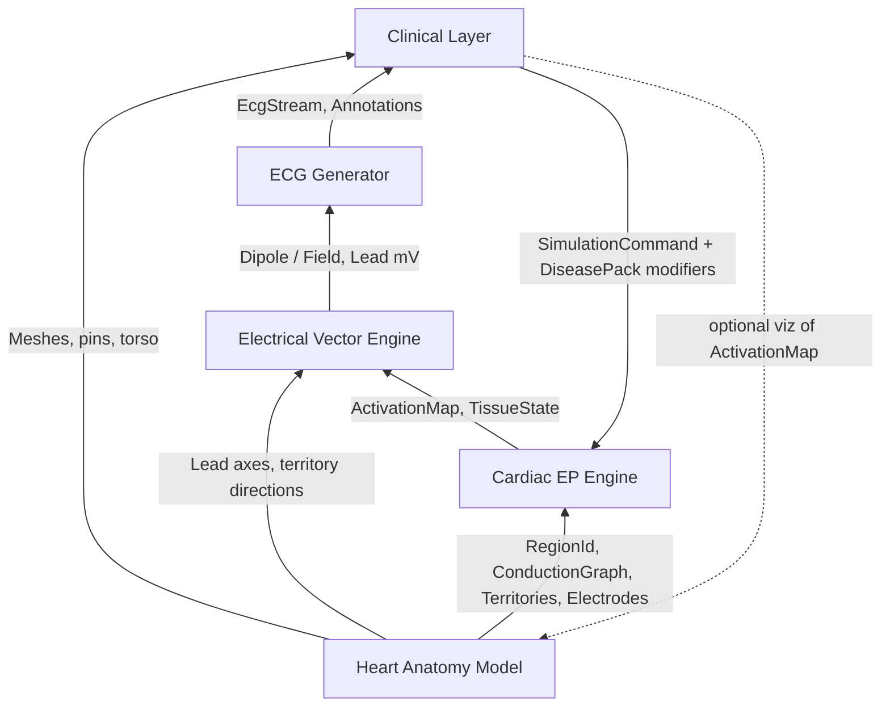

# Future Architecture Design

## ECG Stimulator — Cardiac Electrophysiology Simulation Platform

**Document type:** Software architecture design  
**Status:** Design only (not yet implemented)  
**Related:**
- [`product-requirement-document.md`](./product-requirement-document.md)
- [`core-data-model/`](./core-data-model/) — event-driven TypeScript interfaces (`HeartbeatEvent`, anatomy, EP, vector, ECG, clinical)

---

## Goal

Evolve from today’s single-dipole teaching SPA into a modular medical simulation stack where anatomy, electrophysiology, vectors, ECG synthesis, and clinical presentation are separable, testable, and extensible.

**Design principle:** Each layer speaks only to its neighbors through typed contracts. Disease modules inject parameters at the electrophysiology and/or clinical layers — they never rewrite ECG drawing code or lead axes by hand.

---

## Layered Architecture Overview

```
┌─────────────────────────────────────────────────────────────┐
│                    CLINICAL LAYER                           │
│  Scenarios · Symptoms · Explanations · Cases · Tutor UI     │
└──────────────────────────▲──────────────────────────────────┘
                           │ ClinicalSnapshot + LearningContent
┌──────────────────────────┴──────────────────────────────────┐
│                    ECG GENERATOR                            │
│  Sampling · 12-lead projection display · Monitor / strip    │
└──────────────────────────▲──────────────────────────────────┘
                           │ LeadVoltages(t) + Annotations
┌──────────────────────────┴──────────────────────────────────┐
│               ELECTRICAL VECTOR ENGINE                      │
│  Cardiac dipole / multipole · Lead axes · Injury current    │
└──────────────────────────▲──────────────────────────────────┘
                           │ InstantaneousElectricalField
┌──────────────────────────┴──────────────────────────────────┐
│          CARDIAC ELECTROPHYSIOLOGY ENGINE                   │
│  Pacemakers · Conduction · Refractory · Rhythm rules        │
└──────────────────────────▲──────────────────────────────────┘
                           │ ActivationMap(t) + TissueState
┌──────────────────────────┴──────────────────────────────────┐
│                 HEART ANATOMY MODEL                         │
│  Chambers · Conduction tree · Territories · Electrodes      │
└─────────────────────────────────────────────────────────────┘
```

Bottom layers are **physiology truth**. Top layers are **observation and education**. Diseases change physiology; ECG and UI only observe the result.

---

## 1. Responsibilities of Each Module

### 1.1 Heart Anatomy Model

**Role:** Static (and lightly dynamic) spatial truth of the heart and body — the “scene graph” of medicine, not the waveform math.

| Responsibility | Detail |
|----------------|--------|
| Structural topology | Chambers (RA/LA/RV/LV), valves, great vessels, septum |
| Conduction anatomy | SA node, atria, AV node, His, bundle branches, Purkinje regions |
| Myocardial territories | Anterior, septal, inferior, lateral (and future RCA/LAD/LCx maps) |
| Electrode geometry | RA, LA, RL, LL, V1–V6 in body coordinates |
| Lead educational metadata | Which wall a lead “faces,” placement notes (i18n) |
| Visualization assets | Procedural mesh, optional GLB, torso contour — **rendering only** |

**Does not:** compute action potentials, rates, or millivolts.

**Independence:** Fully independent library. Consumed by the EP engine (for region IDs), the vector engine (for axes / territory directions), and the 3D UI (for meshes and pins).

---

### 1.2 Cardiac Electrophysiology Engine

**Role:** Time-evolving electrical behavior of tissue — the core simulator.

| Responsibility | Detail |
|----------------|--------|
| Automaticity | SA rate, escape foci, AF wavelet generators |
| Conduction delays | Intra-atrial, AV node (PR), His–Purkinje timing |
| Activation sequence | Who fires when: SA → atria → AV → His → ventricles |
| Block / dissociation | Failed AV conduction, independent clocks |
| Refractory / width | QRS widening, flattened P (e.g. hyperkalemia proxies) |
| Tissue modifiers | Ischemia severity, [K⁺], local conduction velocity |
| Output | `ActivationMap(t)` + `TissueState` per anatomical region |

**Does not:** project onto leads or draw ECG paper.

**Maps from current codebase:** Generalizes `conduction.ts` + rhythm parts of `diseases.buildPlan` into a real state machine, not only Gaussian envelopes.

---

### 1.3 Electrical Vector Engine

**Role:** Convert activation in space into an electrical field / cardiac vector(s).

| Responsibility | Detail |
|----------------|--------|
| Wavefront → vector | Atrial, septal, apical, basal, repolarization contributions |
| Injury current | ST displacement from ischemic territories |
| Electrolyte vector effects | T amplitude/width, U wave, ST depression proxies |
| Lead axes | Einthoven / Goldberger / precordial unit vectors |
| Projection | \(V_{lead} = \mathbf{D} \cdot \mathbf{a}_{lead}\) (v1); later multipole / BSPM-ready |

**Does not:** own disease narratives or Canvas monitors.

**Maps from current codebase:** `dipole.ts` + `leads.ts` + `TERRITORY_VECTOR`.

---

### 1.4 ECG Generator

**Role:** Turn continuous lead voltages into clinical ECG products.

| Responsibility | Detail |
|----------------|--------|
| Temporal sampling | Fixed `fs` (e.g. 250–500 Hz), live + batch |
| 12-lead assembly | I–III, aVR–aVF, V1–V6 |
| Display modes | Cascade monitor, paper strip, rhythm strip |
| Annotations | P/QRS/T fiducials, RR, measured HR |
| Calibration | 25 mm/s, 10 mm/mV |
| Noise / artifact (optional) | Baseline wander, muscle tremor — display realism only |

**Does not:** decide STEMI territory or K⁺ effects; it only samples what the vector engine emits.

**Maps from current codebase:** `generator.ts` + `EcgGrid` / `EcgLead` (split: engine vs view).

---

### 1.5 Clinical Layer

**Role:** Education, scenario control, and clinical meaning.

| Responsibility | Detail |
|----------------|--------|
| Scenario catalog | Normal, STEMI, AF, AV block, hyperkalemia, … |
| Parameter UI | Sliders/selects bound to disease schemas |
| Mechanism copy | What / why / ECG / bedside findings (i18n) |
| Case mode (future) | Virtual patient, tasks, scoring |
| AI tutor (future) | Explains from `ClinicalSnapshot`, not raw samples |
| Sync selection | Lead ↔ electrode ↔ wall highlight |

**Does not:** contain Gaussian timing constants or lead-axis math.

**Maps from current codebase:** `diseases.ts` explain text + `ControlPanel` + `ExplanationPanel` + i18n (physics mapping moves downward).

---

## 2. Data Exchange Between Modules

Contracts are **immutable snapshots** per simulation tick (or per sample). No UI imports EP internals.

### 2.1 Anatomy → Electrophysiology

```
AnatomyModel
  → RegionId[]              # sa, av, his, lv_anterior, ...
  → ConductionGraph         # directed edges + nominal delays
  → TerritoryId[]           # anterior | septal | inferior | lateral
  → ElectrodeSites          # positions (for viz & future BSPM)
```

The EP engine indexes state by `RegionId` / `TerritoryId` defined only in Anatomy.

### 2.2 Electrophysiology → Vector Engine

```
ActivationMap {
  t: seconds
  regions: Record<RegionId, {
    activation: 0..1      # depol intensity
    recovery: 0..1        # repol intensity
    conducts: boolean
  }>
  atriaOrganized: boolean
  ventriclesDrivenBy: 'sa_av' | 'escape' | 'irregular'
}

TissueState {
  ischemia: Partial<Record<TerritoryId, 0..1>>
  potassium_mmol_L?: number
  conductionVelocityScale: number
  actionPotentialDurationScale: number
  injuryCurrentReady: boolean
}
```

### 2.3 Vector Engine → ECG Generator

```
InstantaneousField {
  t: seconds
  dipole: { x, y, z }           # body coordinates
  # future: multipoles[] or surface potentials
}

LeadVoltages {
  t: seconds
  leads: Record<LeadName, mV>
}

Annotations {
  atrialOnsets: number[]
  ventricularOnsets: number[]
  qrsOnsets / tPeaks: ...
}
```

### 2.4 ECG Generator → Clinical Layer

```
EcgStream {
  buffers: Record<LeadName, Float32Array>
  fs, elapsed, measuredHR, selectedLead?
}

ClinicalSnapshot {
  scenarioId
  params: ParamValues
  derivedFindings: string[]     # e.g. "ST↑ V1–V4"
  riskFlags: string[]           # e.g. "time-critical STEMI"
}
```

### 2.5 Clinical → Lower Layers (Control Plane Only)

```
SimulationCommand {
  scenarioId
  params                    # occlusion%, K+, HR, block degree...
  timeScale, pause, seek?
}

→ DiseaseAdapter.map(params) → EpModifiers + optional VectorModifiers
→ EP Engine.apply(modifiers)
```

**Rule:** Clinical never writes millivolts. It only sets physiological modifiers.

### End-to-End Tick

```
t₊Δt
  Clinical params (stable)
       ↓
  EP Engine.step(t) → ActivationMap + TissueState
       ↓
  Vector Engine.evaluate(...) → dipole / field
       ↓
  ECG Generator.sample → 12× mV (+ annotations)
       ↓
  Clinical UI + 3D Anatomy view consume streams
```

A shared clock (`SimulationClock`) sits beside the stack; all layers read the same `t`.

---

## 3. Which Modules Should Be Independent

| Module | Independent? | Allowed dependencies | Forbidden couplings |
|--------|--------------|----------------------|---------------------|
| **Heart Anatomy Model** | **Yes — pure data/asset package** | none (or math utils) | React, Canvas, disease text |
| **EP Engine** | **Yes — pure TS/sim core** | Anatomy types only | Leads, UI, i18n |
| **Vector Engine** | **Yes — pure TS** | Anatomy axes + EP outputs | Disease essays, R3F |
| **ECG Generator** | **Yes — pure TS (+ optional worker)** | Vector outputs | Three.js, scenario labels |
| **Clinical Layer** | **App shell** | All public APIs above | Inline Gaussian/dipole math |
| **3D / Monitor views** | **Presentation adapters** | Anatomy + streams | `buildPlan` hacks |

### Independence Criteria (Professional Sim Software)

1. **EP + Vector + ECG** must run **headless** (Node/tests/CLI strip dump) with no DOM.
2. **Anatomy** is versioned separately from rendering (swap GLB without touching EP).
3. **Disease packs** are plugins: register adapters + content; no fork of the generator.
4. **One-way data** upward for signals; downward only for commands/modifiers.
5. **Binary compatibility of contracts** — UI can change; `.ecg.json` fixtures stay valid.

### Suggested Package Boundaries (Future Monorepo Shape)

```
packages/
  anatomy/          # Heart Anatomy Model
  ep-engine/        # Cardiac Electrophysiology Engine
  vector-engine/    # Electrical Vector Engine
  ecg-generator/    # ECG Generator
  disease-packs/    # STEMI, AF, AV block, hyperK, ...
apps/
  simulator-web/    # Clinical Layer + Viz
```

Even if kept as folders in one repo first, treat them as packages with public `index` APIs.

---

## 4. How Diseases Are Added

### Disease Pack Pattern

Each disease is a **pack**, not a branch of `generator.ts`:

```
DiseasePack {
  id, category, version
  paramSchema          # UI knobs + validation
  mapToEpModifiers(params) → EpModifiers
  mapToTissue(params) → TissueState patch   # optional
  deriveFindings(snapshot) → string[]       # clinical layer
  explain(params, locale) → LearningContent
}
```

```
EpModifiers {
  saRate? | meanVentricularRate?
  avDelay_s? | avBlock: 'none' | '1st' | '3rd' | ...
  atrialMode: 'sinus' | 'fibrillation' | 'standstill'
  ventricularEscapeRate?
  qrsDurationScale?
  repolarization: { tAmp, tWidth, uAmp, stGlobal }
  ischemia?: { territory, severity 0..1 }
}
```

**Registration:** `DiseaseRegistry.register(pack)` → Clinical catalog auto-updates.

---

### 4.1 STEMI (Acute MI)

| Layer | What the pack changes |
|-------|------------------------|
| Anatomy | Uses existing territory IDs (anterior/septal/inferior/lateral); may later attach coronary → territory map |
| EP | Mild rate change; optional local conduction slowing in ischemic regions; **does not** invent ST in EP |
| Vector | **Primary effect:** injury current along `TERRITORY_VECTOR[territory] × severity`; reciprocal territories negative; hyperacute T via repol scaling |
| ECG | Unchanged code — samples elevated ST in facing leads |
| Clinical | Occlusion %, territory select; mechanism of ATP → injury current; emergent reperfusion teaching |

**Extension path:** Subendocardial ischemia (depression only), evolving MI stages (hyperacute → Q waves) as additional `TissueState` stages without a new ECG renderer.

---

### 4.2 Atrial Fibrillation

| Layer | Change |
|-------|--------|
| Anatomy | Same atria regions; mark as “no single wavefront” |
| EP | **Primary:** `atrialMode = fibrillation`; suppress organized SA–atrial coupling; irregular AV bombardment → irregular RR schedule (seeded for sync); no PR linkage |
| Vector | Small chaotic atrial contributions; no P-vector sequence |
| ECG | Fibrillatory baseline + irregular QRS timing from annotations |
| Clinical | Stroke risk, rate vs rhythm control narrative |

**Independence win:** AF RR schedule lives in EP, not in `EcgGrid` caches.

---

### 4.3 AV Block

| Layer | Change |
|-------|--------|
| Anatomy | AV node / His as graph nodes with failure modes |
| EP | **Primary:** 1° prolongs `avDelay_s`; 3° sets `avBlock = complete` → atrial clock + ventricular escape focus; future 2° uses probabilistic or patterned drop (Wenckebach counter) |
| Vector | Wider QRS if escape is ventricular (activation origin shifts) |
| ECG | Dissociated P/QRS from EP annotations |
| Clinical | Syncope / pacing indications |

**Future 2°** adds only EP rules + explain text — no lead-axis changes.

---

### 4.4 Hyperkalemia

| Layer | Change |
|-------|--------|
| Anatomy | None (global membrane effect) |
| EP | **Primary physiological mapping:** raised extracellular K⁺ → reduced excitability proxies: ↑T peaking schedule, ↓P amplitude, ↑PR, ↑QRS duration scale, possible sine-wave progression thresholds |
| Vector | Applies repolarization / QRS width scales from `TissueState`; optional global ST |
| ECG | Morphology follows automatically |
| Clinical | K⁺ slider stages (mild→severe); emergency treatment teaching |

**Hypokalemia** is the same pack family with opposite modifiers (U wave, flat T, ST depression) — shared `ElectrolytePack` base class.

---

### Adding a New Disease (Checklist)

1. Define `paramSchema` and clinical copy (Clinical Layer / i18n).
2. Implement `mapToEpModifiers` (+ tissue patch if regional).
3. If new anatomy is needed (e.g. accessory pathway), extend **Anatomy** graph only.
4. If a new field effect is needed (e.g. Brugada pattern), extend **Vector** with a named contribution — still not Canvas code.
5. Register the pack; add **headless fixtures** (golden 12-lead snippets).
6. Wire the scenario button — done.

**Never:** hard-code “if disease === stemi then lead V2 += 0.4” inside the ECG Generator.

---

## 5. Cross-Cutting Platform Concerns

| Concern | Placement |
|---------|-----------|
| Simulation clock / timeScale | Platform service; all engines read `t` |
| Deterministic seeds (AF) | EP engine |
| 3D heart versions (V1/V2/V3) | Clinical viz adapters over **same** Anatomy + ActivationMap |
| i18n | Clinical Layer only |
| Offline / local-first | Keep engines in-browser; no mandatory backend |
| Tests | Golden vectors per disease at Anatomy→…→ECG boundary |
| Future AI tutor | Consumes `ClinicalSnapshot` + findings, not raw ring buffers |

---

## 6. Target Runtime Diagram



---

## 7. Migration Stance (From Current Code)

| Current artifact | Future home |
|------------------|-------------|
| `leadMap` / `electrodeMap` / chamber layout | Heart Anatomy Model |
| `conduction.ts` + rhythm flags in `CyclePlan` | Cardiac EP Engine |
| `dipole.ts` + `leads.ts` | Electrical Vector Engine |
| `generator.ts` + monitor sampling | ECG Generator |
| `diseases.ts` explain + ControlPanel | Clinical Layer + Disease Packs |
| `CyclePlan` | Split into `EpModifiers` + derived `TissueState` + display hints |

Near-term architecture success looks like: **same educational UX**, but STEMI / AF / block / hyperkalemia are packs, and a test can assert “anterior STEMI ⇒ ST↑ in V2–V4” without mounting React.

---

## 8. Design Summary

- **Anatomy** = where things are.
- **EP** = when and whether they fire.
- **Vector** = how firing becomes a field.
- **ECG Generator** = how the field is measured and shown as 12 leads.
- **Clinical** = what it means for the learner and how they steer the patient.

Diseases are **modifier packs** on EP/tissue (and sometimes vector contributions), never forks of the monitor. That is the difference between a demo waveform toy and professional medical simulation software.

---

## 9. Core Data Model (Event-Driven)

Typed contracts live in [`core-data-model/`](./core-data-model/). A **heartbeat** is a first-class physiological aggregate (`HeartbeatEvent`) that bundles schedule, SA/atrial/AV/ventricular/repolarization markers, electrical vectors, and ECG output. Discrete `PhysiologicalEvent`s drive real-time animation; continuous EP/ECG frames drive the monitor.

| File | Concern |
|------|---------|
| `anatomy.ts` | Chambers, regions, territories, electrodes |
| `conduction.ts` | Conduction graph, pacemakers, AV block config |
| `activation.ts` | `ActivationMap`, `TissueState`, EP frames |
| `vector.ts` | Dipole, contributions, lead axes / voltages |
| `ecg.ts` | Samples, ring buffers, strips, annotations |
| `clinical.ts` | Findings, risk flags, disease-pack descriptors |
| `heartbeat.ts` | `HeartbeatEvent`, event bus messages, scheduler |
| `index.ts` | Re-exports |

---

*Design only — implementation is a separate workstream.*
